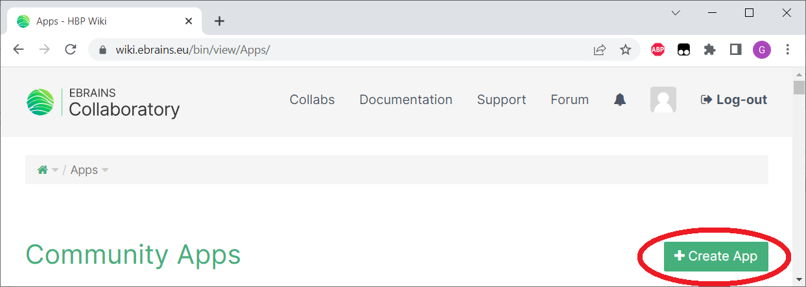
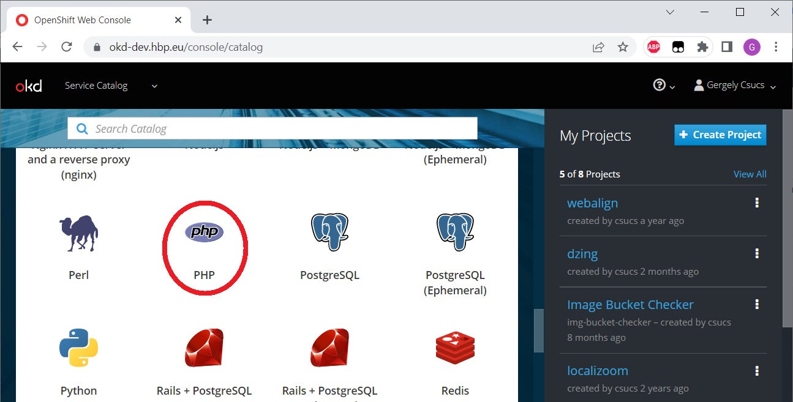
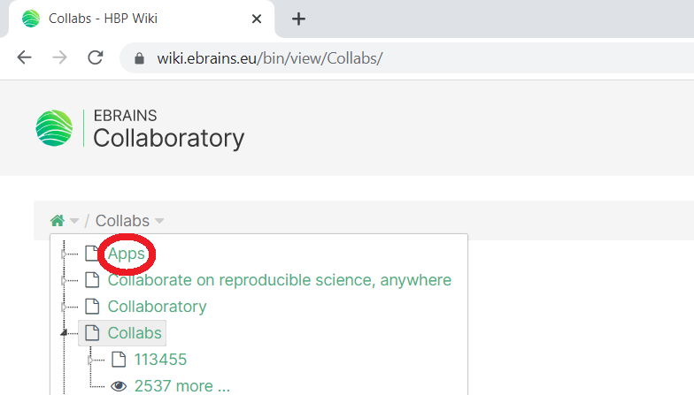

# Collab.PHP
## _A walkthrough of creating an HBP/EBrains collaboratory app_
OIDC token exchange is done in PHP, hence the name. Some extra steps are included, one can skip them later.

## 1. Access
In order to succeed, an EBrains account will be necessary, https://ebrains.eu/register/
* check if you can log in to https://okd-dev.hbp.eu/ (use the Keycloak option)
* check if you can log in to https://wiki.ebrains.eu/bin/view/Collabs/
* and if you can create an app, https://wiki.ebrains.eu/bin/view/Apps/ should offer a "+ Create App" button on the top-right.



If the Apps page doesn't allow creating a new one, contact support as described here: https://wiki.ebrains.eu/bin/view/Collabs/collaboratory-community-apps/Community%20App%20Developer%20Guide/

## 2. Base app, no OIDC magic yet
### 2.1. GitHub
Create new GitHub repo, with a single `index.html` in it. Throughout this tutorial the repo is going to be https://github.com/Tevemadar/Collab.PHP/

    <!DOCTYPE html>
    <html lang="en">
        <head>
            <title>Collab check</title>
            <meta charset="UTF-8">
        </head>
        <body>
            <pre id="pre"></pre>
            <script>
                let state = {};
                for (let setting of location.search.substring(1).split("&")) {
                    let [key, value] = setting.split("=");
                    state[key] = value;
                }
                document.getElementById("pre").innerText = JSON.stringify(state, null, 4);
            </script>
        </body>
    </html>

This file simply collects the URL parameters provided by the collab environment and display them. `index.html` in the complete example code is going to be different, this one is preserved in the repo as `index_start.html`.

### 2.2. OKD-Dev
These are standard steps for any contemporary app, including the need for HTTPS.

#### 2.2.1. Create app
1. Go to https://okd-dev.hbp.eu/
2. Click on PHP from the Catalog  

3. Click Next on the Information screen
4. Select "Create Project" under "Add to Project"
5. Fill in mandatory field "Project Name", Recently it allows lower-case letters, numbers and dashes only, I used ```collab-example```, but it probably won't be visible on any screenshot
6. Fill in mandatory field "Application Name", similar restrictions. I picked ```collab-php```
7. Fill in mandatory field "Git Repository". Use the actual one, for me it's ```https://github.com/Tevemadar/Collab.PHP.git```
8. Click "Create", then "Close".

After a bit of time the app becomes available as `http://<application name>-<project name>.apps-dev.hbp.eu`. `http://collab-php-collab-example.apps-dev.hbp.eu/` with these particular settings. It can be checked with some ad-hoc parameters, like `http://collab-php-collab-example.apps-dev.hbp.eu/?a=b&c=d`.

#### 2.2.2. Secure route
Collab is on HTTPS, so collab apps have to be on HTTPS too.
1. Just to be on the same page, literally, go back to the catalog page, either via clicking on the "OKD" logo in the top-left corner, or just navigating to https://okd-dev.hbp.eu/ directly. Then click on the project on the right, under "My Projects", it's `collab-example` for this tutorial
2. "Applications"/"Routes" on the left, then click on the "Name" (first column) of the route (which matches with the name of the application, `collab-php` for me)
3. "Actions"/"Edit" on the top-right
4. Mark "Secure route" under "Security"
5. "Save" (it's on the very bottom of the page)

Suddenly the app is on HTTPS, one can click on the link from the page directly. Some ad-hoc URL parameters can be added too. As indicated earlier, this version of the page is preserved under a different name, can be tested as https://collab-php-collab-example.apps-dev.hbp.eu/index_start.html?testfield=test&something=else  
The app is ready for testing in collab environment.

### 2.3. Collab app
1. Log in to https://wiki.ebrains.eu
2. Click on "Collabs" on the top, then open any of the tiny down arrows on the left (next to the small green house icon or the "Collabs" text), and click on "Apps". Or just open the page directly: https://wiki.ebrains.eu/bin/view/Apps/  
3. Click on "+ Create App"
4. Give a "Title" to the app, this is actually its name. `Collab.PHP` in this tutorial
5. On the right side the "Community App" template should be selected already
6. Click on "Create" on the bottom-left
7. Specify the "Main URL". As the explanation points out, it has to be HTTPS. It's `https://collab-php-collab-example.apps-dev.hbp.eu/` or `https://collab-php-collab-example.apps-dev.hbp.eu/index.html` for the settings used in this tutorial
8. While it may be tempting, don't mark the app as "Under development". Contrary to the description, you won't be able to display it.
9. Click "Save & View" on the bottom

### 2.4. Collab
#### 2.4.1. If you don't have a playground collab yet:
1. Click on "Collabs" on the top, then "Create a collab" on the right
2. A "Collab Title" has to be provided, it's a readable name of your liking. This will be visible to users. It's `Collab.PHP` for this tutorial 
3. A "slug" is generated in parallel, it has similar restrictions like on OKD, so the slug will be lower-case and separated by dashes. One can edit it, but for the example it's just left as `collab-php`
4. Click on "Create Collab" on the bottom.

In the case of this example "Public" visibility has been selected too, the example collab is available to anyone as https://wiki.ebrains.eu/bin/view/Collabs/collab-php  
When redirected to the new collab it may be a good idea to click on the black heart icon (it becomes red afterwards). It adds a collab to your favourites, making it easier to find from the "Collabs" search page (just mark "Favourites" on the left).  
The previous page with visibility and the like can be accessed via "Settings". "Edit" actually edits the wiki text of this landing page.

#### 2.4.2. "Install" the app
1. Click on the "+ Create" button on the right
2. Provide a title for the page, this will be visible in the list on the left, `Example App` for this tutorial - could be `Collab.PHP` of course, but almost everything is called that so far
3. Select "Community App" on the right (it's important now, otherwise a wiki article would be created)
4. Click on "Create"
5. Find the app in the list/grid. If it's marked as "Under development" it won't be there and there's nothing you can do to see it in this view. Click on "Select" below it
6. Click on "Save & View" on the bottom.

The app should be running, it displays the collection of collab parameters. For the example app:

    {
        "clb-collab-id": "collab-php",
        "clb-doc-path": "",
        "clb-doc-name": "Example+App",
        "clb-drive-id": "22e48dab-7f9a-4fe4-a5bb-66e26d9e6565"
    }
From storage point of view `clb-collab-id` is used for accessing the Bucket, and `clb-drive-id` is used for accessing the Drive.  
Direct link: https://wiki.ebrains.eu/bin/view/Collabs/collab-php/Example%20App (but it will show the final example).