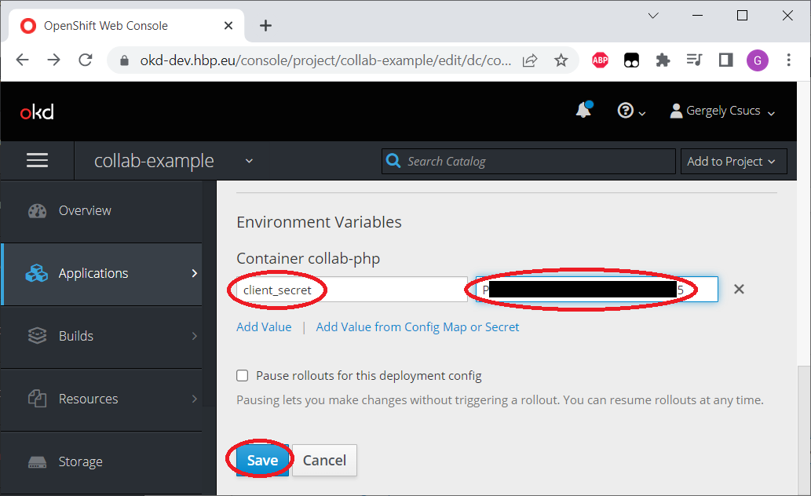

# Collab.PHP
## _A walkthrough of creating an HBP/EBrains collaboratory app_
OIDC code-token exchange is done in PHP, hence the name. Some extra steps are included, one can skip them later.

## 1. Access
In order to succeed, an EBrains account will be necessary, https://ebrains.eu/register/
* check if you can log in to https://okd-dev.hbp.eu/ (use the Keycloak option)
* check if you can log in to https://wiki.ebrains.eu/bin/view/Collabs/
* and if you can create an app, https://wiki.ebrains.eu/bin/view/Apps/ should offer a "+ Create App" button on the top-right.


If the Apps page doesn't allow creating a new one, contact support as described here: https://wiki.ebrains.eu/bin/view/Collabs/collaboratory-community-apps/Community%20App%20Developer%20Guide/

## 2. Base app, no OIDC magic yet
### 2.1. GitHub
Create new GitHub repo, with a single `index.html` in it. Throughout this tutorial the repo is going to be https://github.com/Tevemadar/Collab.PHP/

    <!DOCTYPE html>
    <html lang="en">
        <head>
            <title>Collab check</title>
            <meta charset="UTF-8">
        </head>
        <body>
            <pre id="pre"></pre>
            <script>
                let state = {};
                for (let setting of location.search.substring(1).split("&")) {
                    let [key, value] = setting.split("=");
                    state[key] = value;
                }
                document.getElementById("pre").innerText = JSON.stringify(state, null, 4);
            </script>
        </body>
    </html>

This file simply collects the URL parameters provided by the collab environment and display them. `index.html` in the complete example code is going to be different, this one is preserved in the repo as `index_start.html`.

### 2.2. OKD-Dev
These are standard steps for any contemporary app, including the need for HTTPS.

#### 2.2.1. Create app
1. Go to https://okd-dev.hbp.eu/
2. Click on PHP from the Catalog  

3. Click Next on the Information screen
4. Select "Create Project" under "Add to Project"
5. Fill in mandatory field "Project Name", Recently it allows lower-case letters, numbers and dashes only, I used ```collab-example```, but it probably won't be visible on any screenshot
6. Fill in mandatory field "Application Name", similar restrictions. I picked ```collab-php```
7. Fill in mandatory field "Git Repository". Use the actual one, for me it's ```https://github.com/Tevemadar/Collab.PHP.git```
8. Click "Create", then "Close".

After a bit of time the app becomes available as `http://<application name>-<project name>.apps-dev.hbp.eu`. `http://collab-php-collab-example.apps-dev.hbp.eu/` with these particular settings. It can be checked with some ad-hoc parameters, like `http://collab-php-collab-example.apps-dev.hbp.eu/?a=b&c=d`.

#### 2.2.2. Secure route
Collab is on HTTPS, so collab apps have to be on HTTPS too.
1. Just to be on the same page, literally, go back to the catalog page, either via clicking on the "OKD" logo in the top-left corner, or just navigating to https://okd-dev.hbp.eu/ directly. Then click on the project on the right, under "My Projects", it's `collab-example` for this tutorial
2. "Applications"/"Routes" on the left, then click on the "Name" (first column) of the route (which matches with the name of the application, `collab-php` for me)
3. "Actions"/"Edit" on the top-right
4. Mark "Secure route" under "Security"
5. "Save" (it's on the very bottom of the page)

Suddenly the app is on HTTPS, one can click on the link from the page directly. Some ad-hoc URL parameters can be added too. As indicated earlier, this version of the page is preserved under a different name, can be tested as https://collab-php-collab-example.apps-dev.hbp.eu/index_start.html?testfield=test&something=else  
The app is ready for testing in collab environment.

### 2.3. Collab app
1. Log in to https://wiki.ebrains.eu
2. Click on "Collabs" on the top, then open any of the tiny down arrows on the left (next to the small green house icon or the "Collabs" text), and click on "Apps". Or just open the page directly: https://wiki.ebrains.eu/bin/view/Apps/  
3. Click on "+ Create App"
4. Give a "Title" to the app, this is actually its name. `Collab.PHP` in this tutorial
5. On the right side the "Community App" template should be selected already
6. Click on "Create" on the bottom-left
7. Specify the "Main URL". As the explanation points out, it has to be HTTPS. It's `https://collab-php-collab-example.apps-dev.hbp.eu/` or `https://collab-php-collab-example.apps-dev.hbp.eu/index.html` for the settings used in this tutorial
8. While it may be tempting, don't mark the app as "Under development". Contrary to the description, you won't be able to display it.
9. Click "Save & View" on the bottom

### 2.4. Collab
#### 2.4.1. If you don't have a playground collab yet
1. Click on "Collabs" on the top, then "Create a collab" on the right
2. A "Collab Title" has to be provided, it's a readable name of your liking. This will be visible to users. It's `Collab.PHP` for this tutorial 
3. A "slug" is generated in parallel, it has similar restrictions like on OKD, so the slug will be lower-case and separated by dashes. One can edit it, but for the example it's just left as `collab-php`
4. Click on "Create Collab" on the bottom.

In the case of this example "Public" visibility has been selected too, the example collab is available to anyone as https://wiki.ebrains.eu/bin/view/Collabs/collab-php  
When redirected to the new collab it may be a good idea to click on the black heart icon (it becomes red afterwards). It adds a collab to your favourites, making it easier to find from the "Collabs" search page (just mark "Favourites" on the left).  
The previous page with visibility and the like can be accessed via "Settings". "Edit" actually edits the wiki text of this landing page.

#### 2.4.2. "Install" the app
1. Click on the "+ Create" button on the right
2. Provide a title for the page, this will be visible in the list on the left, `Example App` for this tutorial - could be `Collab.PHP` of course, but almost everything is called that so far
3. Select "Community App" on the right (it's important now, otherwise a wiki article would be created)
4. Click on "Create"
5. Find the app in the list/grid. If it's marked as "Under development" it won't be there and there's nothing you can do to see it in this view. Click on "Select" below it
6. Click on "Save & View" on the bottom.

The app should be running, it displays the collection of collab parameters. For the example app:

    {
        "clb-collab-id": "collab-php",
        "clb-doc-path": "",
        "clb-doc-name": "Example+App",
        "clb-drive-id": "22e48dab-7f9a-4fe4-a5bb-66e26d9e6565"
    }
From storage point of view `clb-collab-id` is used for accessing the Bucket, and `clb-drive-id` is used for accessing the Drive.  
Direct link: https://wiki.ebrains.eu/bin/view/Collabs/collab-php/Example%20App (but it will show the final example).

## 3. Full app, with OIDC
### 3.1. OIDC registration
This is what you can read: https://wiki.ebrains.eu/bin/view/Collabs/the-collaboratory/Documentation%20IAM/FAQ/OIDC%20Clients%20explained/1.%20Registering%20an%20OIDC%20client%20v2/  
And this is what you can click: https://lab.ch.ebrains.eu/hub/user-redirect/lab/tree/shared/Collaboratory%20Community%20Apps/Managing%20an%20OpenID%20Connect%20client%20-%20V2.ipynb
1. The link starts up Jupyter Lab. Click on "Sign in with GenericOAuth2" if necessary
2. Leave "Server Options" on the official image, press "Start"
3. If it complains something about `/shared`, and ends up showing a selection of notebook templates, open the link (https://lab.ch.ebrains.eu/hub/user-redirect/lab/tree/shared/Collaboratory%20Community%20Apps/Managing%20an%20OpenID%20Connect%20client%20-%20V2.ipynb) via the address bar again. Sometimes the drive starts up slower than Jupyter, known bug
4. Now you are in the notebook for sure
5. In the first cell after "1. Introduction" check that it says `API = API_PROD`, and give an actual `clientId` for the app. In this tutorial it's going to be `clientId = "Collab-PHP"` (this id can't contain `.`)
6. Press the "Play" button on the top in order to run the cell. Keyboard shortcut: Shift+Enter
7. Comment cells can be "run" too, it simply skips them, so press "Play" or Shift+Enter 3 more times (so the cell with `bearer_token` runs too)
8. The `response = requests.post(` block under "3, Creating a new OIDC client" has to be edited, this is where everything happens:
    * `clientId` is filled out already
    * set a `name` and a `description`, though they're not very visible later
    * `rootUrl` and `baseUrl` are the url of the actual client, `https://collab-php-collab-example.apps-dev.hbp.eu` in this tutorial
    * `redirectUris` can use a wildcard or the actual name of the PHP file. For the tutorial it's the former, `https://collab-php-collab-example.apps-dev.hbp.eu/*` (the `*` could be `token.php`, a file created in a later step)
    * provide `contacts`, semicolon-separated list of email addresses
    * scopes: move `profile` and `team` to `defaultClientScopes`, apps can't really work without them. Also add `"web-origins"`, so the two lines are  
    `"defaultClientScopes": ["openid", "email","profile","team","web-origins"],`  
    `"optionalClientScopes": ["group"]`
    * provide `maintainers`, they're user names. The list can be left empty, a separate `owner` field will be generated anyway (for the user who does the registration)  
    
9. Run the cell ("Play" or Shift+Enter)
10. Below the cell a long JSON is displayed. Right-click on it and "Copy Output to Clipboard", and store it into some text file on your computer
11. If this file gets lost for any reason, the next runnable cell (under "4. Fetching your OIDC client settings") shows how to get it back. In such case fill in and run the `clientId` cell, run the `bearer_token`, skip the actual registration, and run this cell instead. The only thing what will be missing is the `registrationAccessToken` line, that one is shown at registration only
12. Most fields will be familiar, they contain the details which were sent in a moment ago. The field we actually need is the `secret`. This piece of text will be used in the code-token exchange  


### 3.2. Finalizing index.html
Instead of displaying collab arguments, `index.html` will forward users to the EBrains IAM (Identity and Access Management) service. The arguments will be kept in the `state` url parameter which the application will get back after this pass.  
The file is a somewhat reusable one, containing two separate lines for setting `client_id` (`Collab-PHP` here) and `redirect_uri` (the actual location where user is redirected after passing IAM, `https://collab-php-collab-example.apps-dev.hbp.eu/token.php` in this tutorial)

    <!DOCTYPE html>
    <html lang="en">
        <head>
            <title>Redirect page</title>
            <meta charset="UTF-8">
            <script>
                let state = {};
                for (let setting of location.search.substring(1).split("&")) {
                    let [key, value] = setting.split("=");
                    state[key] = value;
                }
                let client_id = "Collab-PHP";
                let redirect_uri = "https://collab-php-collab-example.apps-dev.hbp.eu/token.php";
                location.href = `https://iam.ebrains.eu/auth/realms/hbp/protocol/openid-connect/auth?response_type=code&login=true&client_id=${client_id}&redirect_uri=${redirect_uri}&state=${encodeURIComponent(JSON.stringify(state))}`;
            </script>
        </head>
        <body>
            Redirecting to IAM...
        </body>
    </html>

### 3.3. Storing `secret` on OKD
This `secret` would not have a good place on GitHub, so it should rather be kept somewhere else, like in an environment variable on OKD.

1. Visit https://okd-dev.hbp.eu/ again, log in if needed
2. Select the project on the right
3. Open the "..." (vertical) menu of the app on the far-right, and select "Edit"
4. Scroll down to "Environment Variables"
5. Give a name to the variable (`client_secret` in this tutorial), in the box on the left
6. Paste the value into the box on the right (do not surround it with quotation marks or anything)
7. Press "Save" on the bottom


### 3.4. Acquiring token
The callback, `token.php`, will get an url parameter called `code`, and that can be exchanged for a token, coupled with the `secret`.

Key parts of the following snippet:
* `client_id` is used again
* `redirect_uri` has to match with the `redirect_uri` provided to IAM. Of course no redirection will happen now, this is a security measure
* `secret` is taken from the environment variable created earlier, so it won't be visible in the source code
* `code` comes from the url parameter
* the request itself is a `POST`

Put together:

    <?php
    $token_params = http_build_query(array(
        "client_id" => "Collab-PHP",
        "redirect_uri" => "https://collab-php-collab-example.apps-dev.hbp.eu/token.php",
        "grant_type" => "authorization_code",
        "code" => filter_input(INPUT_GET, "code"),
        "client_secret" => getenv("client_secret")
            ));
    $token_ch = curl_init("https://iam.ebrains.eu/auth/realms/hbp/protocol/openid-connect/token");
    curl_setopt_array($token_ch, array(
        CURLOPT_RETURNTRANSFER => true,
        CURLOPT_POST => true,
        CURLOPT_POSTFIELDS => $token_params
    ));
    $token_res = curl_exec($token_ch);
    curl_close($token_ch);
    
    $token_obj = json_decode($token_res, true);
    $token = $token_obj["access_token"];
    
    $state = json_decode(urldecode(filter_input(INPUT_GET, "state")), true);
    $state["token"] = $token;
    ?>

`$token_res` is going to be a JSON (text), which can be then parsed and its `access_token` field is the actual token. The `state` url parameter is the same what `index.html` provided earlier, so it's also a JSON in this case. This PHP snippet decodes `state` and adds a `token` field to it. The result can be injected into JavaScript as something like

    const state =<?php echo json_encode($state); ?>;

### 3.5. Using the token to access bucket from client-side JavaScript
This example saves and loads `hello.txt` to/from the bucket of the current collab, using JavaScript `fetch()` calls. The filename is hardcoded, but content is customized in a text area. Documentation of the Data Proxy API can be found here: https://data-proxy.ebrains.eu/api/docs

This snippet is a full HTML document, but it's still part of `token.php`, it follows the `?>` line directly, and has the previously mentioned PHP->JS transition. For separate HTML files, the `state` object could be forwarded as url parameters.

    <!DOCTYPE html>
    <html>
        <head>
            <title>Collab example</title>
            <meta charset="UTF-8">
            <script>
                const state = <?php echo json_encode($state); ?>;
                const bucket = state["clb-collab-id"];
                const token = state.token;
    
                async function save() {
                    const upload = await fetch(
                            `https://data-proxy.ebrains.eu/api/v1/buckets/${bucket}/hello.txt`, {
                                method: "PUT",
                                headers: {
                                    authorization: `Bearer ${token}`
                                }
                            }
                    ).then(response => response.json());
                    if (!upload.hasOwnProperty("url")) {
                        alert("Can't save: " + JSON.stringify(upload));
                        return;
                    }
                    fetch(upload.url, {
                        method: "PUT",
                        headers: {
                            'Content-Type': 'text/plain'
                        },
                        body: document.getElementById("input").value
                    });
                }
    
                async function load() {
                    const download = await fetch(
                            `https://data-proxy.ebrains.eu/api/v1/buckets/${bucket}/hello.txt?redirect=false`, {
                                headers: {
                                    authorization: `Bearer ${token}`
                                }
                            }
                    ).then(response => response.json());
                    if (!download.hasOwnProperty("url")) {
                        alert("Can't load: " + JSON.stringify(download));
                        return;
                    }
                    fetch(download.url)
                            .then(response => response.text())
                            .then(text => document.getElementById("output").innerText = text);
                }
            </script>
        </head>
        <body>
            <textarea id="input" rows="5" style="width:80%"></textarea><br>
            <button onclick="save()">Save</button><hr>
            <button onclick="load()">Load</button>
            <div id="output"></div>
        </body>
    </html>

Important parts:
* uploading happens via a pair of `PUT` requests:
    1. a request is issued to the Data Proxy, this request needs the `token` in its `Authorization` header, prefixed with the text `Bearer` (and esparated by a space)
    2. the result of this request is a JSON, containing an `url` field or an error message
    3. actual data has to be submitted to this `url`, with no authorization header. This is a so called tempurl, with a couple seconds of validity only (transmission can take longer, just the connection has to be established in the validity period)
* downloading also happens via a pair of `GET` request, first a request to the Data Proxy with authorization, and url paramter `redirect=false`, then a second one to a tempurl, without authorization. The `redirect=false` parameter is needed because otherwise the Data Proxy tries to be helpful and issue the tempurl with a HTTP 3xx redirect header. For some reason browsers re-send authorization in this case, which then fails. This redirection works in a couple other environments though (like Python).

### 3.6. Seeing the code in action


